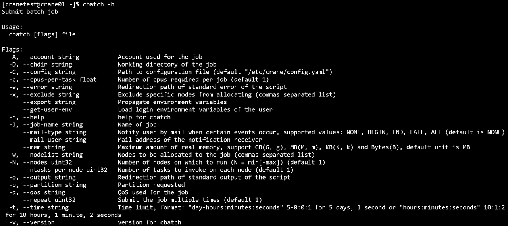

# cbatch 提交批处理作业 #

**cbatch主要是将用户描述整个计算过程的脚本传递给作业调度系统，并为作业分配作业号，等待作业调度系统为其分配资源并执行。**

CraneSched系统中必须有用户和账号才能提交作业，添加用户和账户请参考[**cacctmgr教程**](./cacctmgr.md)。

首先介绍一个简单的单节点作业的例子:

下列作业将申请一个节点，一个CPU核心，并在计算节点上运行hostname并退出

~~~bash
#!/bin/bash
#CBATCH --ntasks-per-node 1
#CBATCH --node 1
#CBATCH -c 1
#CBATCH --mem 20M
#CBATCH --time 0:3:1
#CBATCH -o job.out
#CBATCH -p CPU
#CBATCH -J Test_Job

hostname
~~~

假设上面作业脚本的文件名为cbatch_test.sh，通过cbatch命令提交：

~~~bash
cbatch cbatch_test.sh
~~~

**cbatch运行结果展示**

#### 主要参数： ####

- **--help/-h**：显示帮助
- **-A/--account string**：提交作业的账户
- **-D/--chdir string**:任务工作路径
- **-C/--config string**：配置文件路径(默认 "/etc/crane/config.yaml")
- **-c/--cpus-per-task float**：每个节点申请的CPU核心数
- **-e/--error string**: 指定脚本错误日志定向路径
- **-J/--job-name string**：作业名
- **--mem string**：每个节点申请的内存大小
- **-N/--nodes uint32**：申请的节点数量
- **--ntasks-per-node uint32**：每个节点上运行的任务数量
- **-o/--output string**：指定作业的标准输出重定向
- **-p/--partition string**：作业使用的分区/队列
- **-q/--qos string**：指定作业使用的qos名称
- **-t/--time string**：作业的最长运行时间
- **--repeat uint32**：以指定的重复次数提交作业，默认为1
- **-w/--nodelist**：提交作业到指定节点运行
- **-x/--exclude**：提交的作业排除某些指定节点运行
- **--get-user-env**：获取用户的环境变量
- **--gres**:任务申请的设备资源量  
  - 格式为name:type:count如GPU:A100:2 或者name:count如GPU:2，由调度器决定分配给任务的设备type
- **--export string**：设置环境变量
- **--extra-attr string**: json格式提交额外参数
- **--json**: json格式输出命令执行结果
_ **-v/--version**: 查询版本号
- **--mail-type, --mail-user**：设置邮件提醒功能
  - **--mail-user**：设置邮件提醒的收件地址
  - **--mail-type**：设置邮件提醒在任务运行的哪些阶段发送（可用的值包括：NONE、BEGIN、END、FAIL、ALL，默认为 None 即不发送提醒）
  - **注意**：使用邮件提醒功能必须预先配置 Linux 的 mail 命令，同时在 CraneSched 后端启用邮件功能，否则邮件相关参数将被忽略。
  - **例如**：
  
~~~bash
cbatch --mail-type=ALL --mail-user=foo@bar.com cbatch_test.sh
~~~

~~~bash
cbatch cbatch_test.sh
~~~

~~~bash
cbatch -h
~~~

~~~bash
cbatch -A=acct-test cbatch_test.sh
~~~

~~~bash
cbatch -J testjob01 cbatch_test.sh
~~~

~~~bash
cbatch -w crane01,crane03 cbatch_test.sh
~~~

~~~bash
cbatch -p GPU cbatch_test.sh
~~~

~~~bash
cbatch -t 00:25:25 cbatch_test.sh
~~~

~~~bash
cbatch -c 2 cbatch_test.sh
~~~

~~~bash
cbatch --mem 123M cbatch_test.sh
~~~

~~~bash
cbatch -N 2 --ntasks-per-node 2 cbatch_test.sh
~~~

~~~bash
cbatch -D /path test.sh
~~~

~~~bash
cbatch -e error.log test.sh
~~~

~~~bash
cbatch --export ALL test.sh
~~~

~~~bash
cbatch --get-user-env test.sh
~~~

~~~bash
cbatch -o output.out test.sh
~~~

~~~bash
cbatch -q qos_test test.sh
~~~

~~~bash
cbatch --repeat 3 test.sh
~~~

#### 常用环境变量 ####

| 变量名                 | 说明               |
| ---------------------- | ------------------ |
| **CRANE_JOB_NODELIST**   | 作业分配的节点列表 |
| **%j**                   | 作业号             |

**下面介绍提交一个跨节点多核心的例子：**

下列作业将在三个节点上运行，每个节点使用4个CPU核心。

~~~bash
#!/bin/bash
#CBATCH -o crane_test%j.out
#CBATCH -p CPU
#CBATCH -J "crane_test"
#CBATCH --node 3
##CBATCH --ntasks-per-node 4
#CBATCH -c 4
#CBATCH --time 50:00:00

# 生成作业分配的节点的machinefile
echo "$CRANE_JOB_NODELIST" | tr ";" "\n" > crane.hosts

#加载MPI运行环境
module load mpich/4.0 

#执行跨节点并行任务
mpirun -n 13 -machinefile crane.hosts helloWorld > log

~~~
